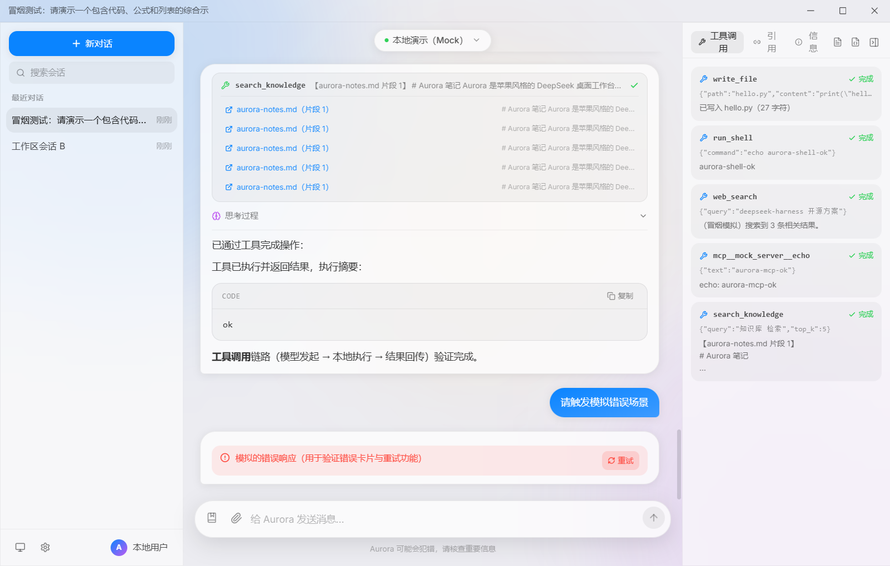
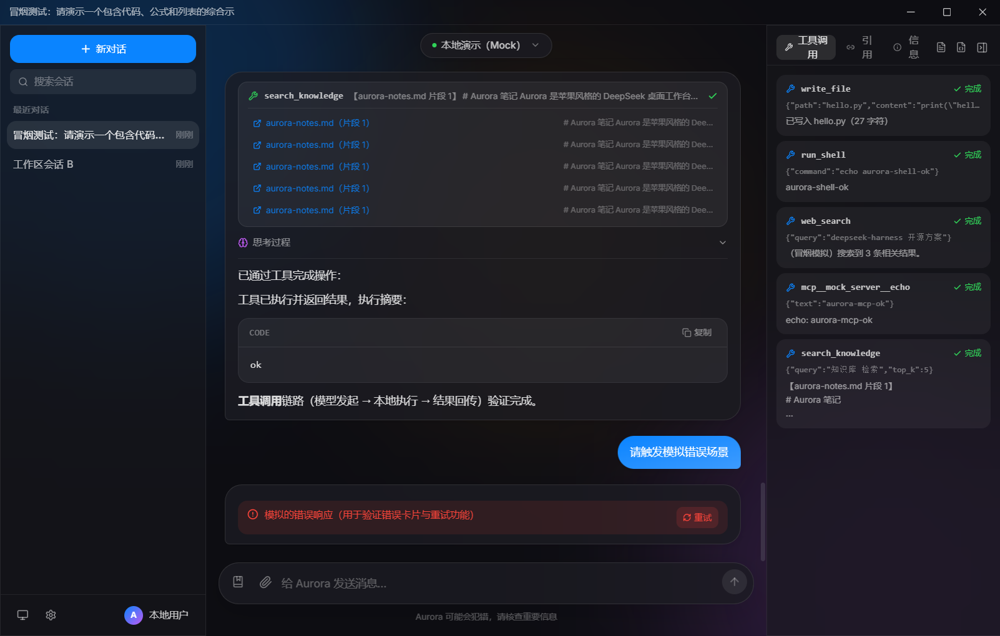

# Aurora ✨

> 苹果质感 × Windows 原生体验的 DeepSeek 桌面工作台 —— 一款开源、本地优先、可真实执行 Agent 工具的 AI 桌面应用。

Aurora 是一个基于 Electron + React 的 DeepSeek Harness 桌面客户端：流式对话、思维链展示、多模型管理、会话持久化，以及一套**真实执行**的 Agent 工具链（文件读写、代码执行、系统命令、联网搜索、网页抓取、MCP 客户端、本地知识库 RAG）。所有数据保存在本机，API Key 用 Windows DPAPI 加密。

<p align="center">
  
  
</p>

## ✨ 功能特性

### 🎨 界面与体验
- Windows 11 风格窗口（右上角最小化/最大化/关闭按钮）+ 苹果式毛玻璃三栏工作台
- 深浅色跟随系统 / 手动切换，毛玻璃材质、弹簧动画、Inter 字体
- 系统托盘常驻：点击切换显示/隐藏，右键菜单快捷操作；窗口后台时回复完成弹系统通知
- 命令面板（`Ctrl+K`）：统一搜索会话、模型与动作
- 快捷键体系：`Ctrl+N` 新对话、`Ctrl+,` 设置、`Ctrl+1~9` 切换会话、`Ctrl+Shift+A` 全局唤起窗口
- 消息操作：编辑（分支）、重新生成、复制、错误重试、导出 Markdown / JSON
- Token 统计：首字延迟、总耗时、费用估算（DeepSeek 官方定价）

### 💬 对话核心
- 流式输出 + 可折叠思维链面板（deepseek-reasoner）
- Markdown 全渲染：GFM 表格、代码高亮（深浅双主题）+ 一键复制、KaTeX 公式
- 多模型管理：DeepSeek 官方 API + 任意 OpenAI 兼容端点（Ollama / LM Studio / 中转站），连接测试一键验证
- 会话管理：SQLite 持久化、搜索、置顶、重命名、自动标题、每日自动备份
- 附件：图片多模态（兼容端点）、文本文件内联上下文
- 提示词系统：全局 + 会话级系统提示词、内置模板库

### 🤖 Agent 工具（真实执行）
| 工具 | 说明 |
| --- | --- |
| `read_file` / `write_file` / `list_dir` | 工作目录沙箱文件操作，防路径越界 |
| `run_python` | 本机 Python 代码执行（30s 超时） |
| `run_shell` | 系统命令（确认弹窗 + 白名单 + `*` 通配） |
| `web_search` | 联网搜索（Bing 零配置解析，无 API Key 要求） |
| `fetch_url` | 网页抓取与正文提取 |
| `search_knowledge` | 本地知识库 RAG 检索（中文 bigram + BM25，文档不出本机） |
| **MCP 客户端** | 接入任意 MCP stdio 服务器，工具并入 Agent 循环 |

工具调用过程以步骤卡片实时可视化（参数 / 状态 / 结果 / 引用来源），检查器右栏汇总展示。

### 🔒 隐私与安全
- 全部数据本地存储（SQLite），API Key DPAPI 加密
- 系统命令执行前强制确认，白名单可控
- 知识库检索全程本机，文档永不上传
- 每日自动备份（保留 7 份）
- 支持 HTTP 代理（模型请求 / 联网搜索 / 网页抓取全链路）

## 📦 安装

### 直接安装（Windows）
从 [Releases](../../releases) 下载 `Aurora Setup 0.1.0.exe`，双击安装即可。

### 从源码运行
```bash
# 环境要求：Node.js ≥ 20（Windows 10/11）
git clone <本仓库地址>
cd aurora
npm install          # 中国网络可设置 ELECTRON_MIRROR=https://npmmirror.com/mirrors/electron/
npm run dev          # 开发模式（Vite HMR + Electron）
npm run dist         # 打包 Windows 安装包（输出 release/）
```

## 🚀 快速上手

1. 启动后点击左下角 **⚙ 设置**
2. 在「DeepSeek Chat」中填入你的 API Key，点 **测试连接**
3. 回到对话区，选择模型，开始聊天
4. 进阶玩法见 [📖 完整使用教程](docs/user-guide.md)

> 没有 API Key？内置「本地演示（Mock）」模型可离线体验全部功能（含工具演示）。

## 🛠 技术栈

| 层 | 选型 |
| --- | --- |
| 桌面框架 | Electron 43 |
| 前端 | React 18 + TypeScript + Tailwind CSS 3 + Vite 6 |
| 数据 | sql.js（SQLite wasm，零原生编译） |
| 渲染 | react-markdown + highlight.js + KaTeX |
| 检索 | 自研 BM25（中文 unigram+bigram 分词） |
| 打包 | electron-builder（NSIS） |

## 🧪 工程质量

- **12 阶段全自动冒烟审计**（`npm run smoke`）：像素采样 + DOM 断言 + 行为交互 + 真实执行验证（文件落盘 / Python 输出 / MCP echo / 剪贴板比对 / SQLite 断言），深浅色双截图自动生成
- 每轮迭代构建 + 审计 + 修复闭环，git 提交历史可回溯

## 📁 项目结构

```
electron/    主进程（窗口、聊天 SSE 转发、工具执行器、MCP、知识库、DB）
src/         渲染层（三栏 UI、组件、hooks）
scripts/     开发脚本与内置 mock MCP 服务器
docs/        需求文档、变更日志、使用教程、截图
```

## 📄 License

[MIT](LICENSE) © Aurora Contributors

## 🙏 致谢

功能设计参考了开源社区方案：[deepseek-harness](https://github.com/HenryZ838978/deepseek-harness)、[Cherry Studio](https://docs.cherryai.com.cn/pre-basic/settings/key-shortcut) 等。
